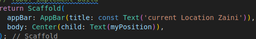

# Praktikum 1: Mengunduh Data dari Web Service (API)

## Langkah 1: Buat Project Baru

## Langkah 2: Cek file pubspec.yaml

Jika berhasil install plugin, pastikan plugin http telah ada di file pubspec ini seperti berikut

## Langkah 3: Buka file main.dart

## Soal 1

Tambahkan nama panggilan Anda pada title app sebagai identitas hasil pekerjaan Anda.


## Langkah 4: Tambah method getData()

Tambahkan method ini ke dalam class \_FuturePageState yang berguna untuk mengambil data dari API Google Books.

## Soal 2

Carilah judul buku favorit Anda di Google Books, lalu ganti ID buku pada variabel path di kode tersebut. Caranya ambil di URL browser Anda seperti gambar berikut ini.
<br>
Kemudian cobalah akses di browser URI tersebut dengan lengkap seperti ini. Jika menampilkan data JSON, maka Anda telah berhasil. Lakukan capture milik Anda dan tulis di README pada laporan praktikum. Lalu lakukan commit dengan pesan "W12: Soal 2".


## Langkah 5: Tambah kode di ElevatedButton

Tambahkan kode pada onPressed di ElevatedButton seperti berikut.


## Soal 3

Jelaskan maksud kode langkah 5 tersebut terkait substring dan catchError!
Capture hasil praktikum Anda berupa GIF dan lampirkan di README. Lalu lakukan commit dengan pesan "W12: Soal 3".<br>
<u>Fungsi substring tersbut digunakan untuk mengambil character dari indeks 0 -450 dan catch error digunakan untuk menangkap error dan menampilkan apa errornya </u><br>


# Praktikum 2: Menggunakan await/async untuk menghindari callbacks

## Langkah 1: Buka file main.dart

Tambahkan tiga method berisi kode seperti berikut di dalam class \_FuturePageState.

```
Future<int> returnOneAsync() async {
  await Future.delayed(const Duration(seconds: 3));
  return 1;
}

Future<int> returnTwoAsync() async {
  await Future.delayed(const Duration(seconds: 3));
  return 2;
}

Future<int> returnThreeAsync() async {
  await Future.delayed(const Duration(seconds: 3));
  return 3;
}
```

## Langkah 2: Tambah method count()

## Langkah 3: Panggil count()

Lakukan comment kode sebelumnya, ubah isi kode onPressed() menjadi seperti berikut.

## Langkah 4: Run

Akhirnya, run atau tekan F5 jika aplikasi belum running. Maka Anda akan melihat seperti gambar berikut, hasil angka 6 akan tampil setelah delay 9 detik.


## Soal 4

Jelaskan maksud kode langkah 1 dan 2 tersebut!
Capture hasil praktikum Anda berupa GIF dan lampirkan di README. Lalu lakukan commit dengan pesan "W12: Soal 4".<br>
<br>
Kode ini mendefinisikan tiga fungsi asinkron yang masing-masing mengembalikan angka 1, 2, dan 3 setelah menunggu 3 detik. Fungsi count menjumlahkan hasil dari ketiga fungsi tersebut secara berurutan, sehingga total waktu yang dibutuhkan adalah 9 detik. Setelah mendapatkan total (6), fungsi ini memperbarui variabel result menggunakan setState

# Praktikum 3: Menggunakan Completer di Future

## Langkah 1: Buka file main.dart

## Langkah 2: Tambahkan variabel dan method

Tambahkan variabel late dan method di class \_FuturePageState seperti ini.

```
late Completer completer;

Future getNumber() {
  completer = Completer<int>();
  calculate();
  return completer.future;
}

Future calculate() async {
  await Future.delayed(const Duration(seconds : 5));
  completer.complete(42);
}
```

## Langkah 3: Ganti isi kode onPressed()

Tambahkan kode berikut pada fungsi onPressed()

## Langkah 4:

Terakhir, run atau tekan F5 untuk melihat hasilnya jika memang belum running. Bisa juga lakukan hot restart jika aplikasi sudah running. Maka hasilnya akan seperti gambar berikut ini. Setelah 5 detik, maka angka 42 akan tampil.<br>


## Soal 5

Jelaskan maksud kode langkah 2 tersebut!
Capture hasil praktikum Anda berupa GIF dan lampirkan di README. Lalu lakukan commit dengan pesan "W12: Soal 5".<br>
Completer digunakan untuk mengelola operasi asinkron. Fungsi getNumber memulai perhitungan yang memerlukan waktu (5 detik), dan setelah selesai, memberikan hasil (angka 42) melalui Completer.<br>


## Langkah 5: Ganti method calculate()

Gantilah isi code method calculate() seperti kode berikut, atau Anda dapat membuat calculate2()

## Langkah 6: Pindah ke onPressed()

Ganti menjadi kode seperti berikut.

```
getNumber().then((value) {
  setState(() {
    result = value.toString();
  });
}).catchError((e) {
  result = 'An error occurred';
});
```

## Soal 6

Jelaskan maksud perbedaan kode langkah 2 dengan langkah 5-6 tersebut!
Capture hasil praktikum Anda berupa GIF dan lampirkan di README. Lalu lakukan commit dengan pesan "W12: Soal 6".<br>
<u>Perbedaannya terletak pada penanganan error yang langkah 2 tidak menggunakan error handling sedangkan langkah 5-6 melakukan penanganan error dengan catchError().</u><br>

# Praktikum 4: Memanggil Future secara paralel

## Langkah 1: Buka file main.dart

Tambahkan method ini ke dalam class \_FuturePageState

## Langkah 2: Edit onPressed()

## Langkah 3: Run

Anda akan melihat hasilnya dalam 3 detik berupa angka 6 lebih cepat dibandingkan praktikum sebelumnya menunggu sampai 9 detik.

## Soal 7

Capture hasil praktikum Anda berupa GIF dan lampirkan di README. Lalu lakukan commit dengan pesan "W12: Soal 7".


## Langkah 4: Ganti variabel futureGroup

Anda dapat menggunakan FutureGroup dengan Future.wait seperti kode berikut.

```
final futures = Future.wait<int>([
  returnOneAsync(),
  returnTwoAsync(),
  returnThreeAsync(),
]);
```

## Soal 8

Jelaskan maksud perbedaan kode langkah 1 dan 4!<br>
<u>FutureGroup digunakan unutk mengelompokkan beberapa futures dan mengelolanya secara terpisah.Future.wait digunakan mengambil daftar futures dan mengembalikan satu future yang selesai ketika semua futures selesai.
</u>

# Praktikum 5: Menangani Respon Error pada Async Code

## Langkah 1: Buka file main.dart

Tambahkan method ini ke dalam class \_FuturePageState

```
 Future returnError() async {
    await Future.delayed(const Duration(seconds: 2));
    throw Exception('Something terrible happened');
  }
```

## Langkah 2: ElevatedButton

```
returnError().then((value) {
                  setState(() {
                    result = 'Success';
                  });
                }).catchError((onError) {
                  setState(() {
                    result = onError.toString();
                  });
                }).whenComplete(() => print('Complete'));
```

## Langkah 3: Run

Lakukan run dan klik tombol GO! maka akan menghasilkan seperti gambar berikut

## Soal 9

Capture hasil praktikum Anda berupa GIF dan lampirkan di README. Lalu lakukan commit dengan pesan "W12: Soal 9".


## Langkah 4: Tambah method handleError()

```
Future handleError() async {
    try {
      await returnError();
    } catch (error) {
      setState(() {
        result = error.toString();
      });
    } finally {
      print('Complete');
    }
  }
```

## Soal 10

Panggil method handleError() tersebut di ElevatedButton, lalu run. Apa hasilnya? Jelaskan perbedaan kode langkah 1 dan 4!
<br>
<u>Fungsi handle error akan memunculkan Complete di Terminal saat setelah memanggil fungsi handle error.Kode pertama menggunakan pendekatan berbasis Future dengan chaining (then, catchError, dan whenComplete), sedangkan kode kedua menggunakan pendekatan async-await yang membuat alur kode lebih linear dan biasanya lebih mudah dibaca.</u>

# Praktikum 6: Menggunakan Future dengan StatefulWidget

## Langkah 1: install plugin geolocator

Tambahkan plugin geolocator dengan mengetik perintah berikut di terminal

```
flutter pub add geolocator

```

## Langkah 2: Tambah permission GPS

Jika Anda menargetkan untuk platform Android, maka tambahkan baris kode berikut di file android/app/src/main/androidmanifest.xml

```
<uses-permission android:name="android.permission.ACCESS_FINE_LOCATION"/>
<uses-permission android:name="android.permission.ACCESS_COARSE_LOCATION"/>
```

Jika Anda menargetkan untuk platform iOS, maka tambahkan kode ini ke file Info.plist

```
<key>NSLocationWhenInUseUsageDescription</key>
<string>This app needs to access your location</string>
```

## Langkah 3: Buat file geolocation.dart

Tambahkan file baru ini di folder lib project Anda.

## Langkah 4: Buat StatefulWidget

Buat class LocationScreen di dalam file geolocation.dart

```
import 'package:flutter/material.dart';
import 'package:geolocator/geolocator.dart';

class LocationScreen extends StatefulWidget {
  const LocationScreen({super.key});

  @override
  State<LocationScreen> createState() => _LocationScreenState();
}

class _LocationScreenState extends State<LocationScreen> {
  String myPosition = '';
  @override
  void initState() {
    // TODO: implement initState
    super.initState();
    getPosition().then((Position myPos) {
      myPosition =
          'Latitude : ${myPos.latitude.toString()} - Longitude : ${myPos.longitude.toString()}';
      setState(() {
        myPosition = myPosition;
      });
    });
  }

  @override
  Widget build(BuildContext context) {
    // TODO: implement build
    return Scaffold(
      appBar: AppBar(title: const Text('current Location Zaini')),
      body: Center(child: Text(myPosition)),
    );
  }

  Future<Position> getPosition() async {
    await Geolocator.requestPermission();
    await Geolocator.isLocationServiceEnabled();
    Position? position = await Geolocator.getCurrentPosition();
    return position;
  }
}

```

## Soal 11

Tambahkan nama panggilan Anda pada tiap properti title sebagai identitas pekerjaan Anda.


## Langkah 6: Edit main.dart

Panggil screen baru tersebut di file main Anda seperti berikut.

home: LocationScreen(),

## Langkah 7: Run

Run project Anda di device atau emulator (bukan browser), maka akan tampil seperti berikut ini.


## Langkah 8: Tambahkan animasi loading

Tambahkan widget loading seperti kode berikut. Lalu hot restart, perhatikan perubahannya.

```
 @override
  Widget build(BuildContext context) {
    final myWidget =
        myPosition == '' ? const CircularProgressIndicator() : Text(myPosition);
    return Scaffold(
      appBar: AppBar(title: const Text('current Location Zaini')),
      body: Center(child: Text(myPosition)),
    );
  }
```

## Soal 12

Jika Anda tidak melihat animasi loading tampil, kemungkinan itu berjalan sangat cepat. Tambahkan delay pada method getPosition() dengan kode await Future.delayed(const Duration(seconds: 3));
Apakah Anda mendapatkan koordinat GPS ketika run di browser? Mengapa demikian?
Capture hasil praktikum Anda berupa GIF dan lampirkan di README. Lalu lakukan commit dengan pesan "W12: Soal 12".<br>
<br>
Bisa karena browser akan meminta akses lokasi tetapi akurasinya lebih rendah dari gps

# Praktikum 7: Manajemen Future dengan FutureBuilder

## Langkah 1: Modifikasi method getPosition()

Buka file geolocation.dart kemudian ganti isi method dengan kode ini.

## Langkah 2: Tambah variabel

Tambah variabel ini di class \_LocationScreenState

## Langkah 3: Tambah initState()

Tambah method ini dan set variabel position

## Langkah 4: Edit method build()

Ketik kode berikut dan sesuaikan. Kode lama bisa Anda comment atau hapus.

```
body: Center(
          child: FutureBuilder(
              future: position,
              builder: (context, AsyncSnapshot<Position> snapshot) {
                if (snapshot.connectionState == ConnectionState.waiting) {
                  return const CircularProgressIndicator();
                } else if (snapshot.connectionState == ConnectionState.done) {
                  return Text(snapshot.data.toString());
                } else {
                  return const Text('');
                }
              })),
    );
```

## Soal 13

Apakah ada perbedaan UI dengan praktikum sebelumnya? Mengapa demikian?
Capture hasil praktikum Anda berupa GIF dan lampirkan di README. Lalu lakukan commit dengan pesan "W12: Soal 13".
Seperti yang Anda lihat, menggunakan FutureBuilder lebih efisien, clean, dan reactive dengan Future bersama UI.<br>
<br>
Saat melakukan proses reload muncul ui yang menunjukan loading sehingga menandakan bahwa proses sedang berlangsung

## Langkah 5: Tambah handling error

Tambahkan kode berikut untuk menangani ketika terjadi error. Kemudian hot restart.

```
else if (snapshot.connectionState == ConnectionState.done) {
  if (snapshot.hasError) {
     return Text('Something terrible happened!');
  }
  return Text(snapshot.data.toString());
}
```

## Soal 14

Apakah ada perbedaan UI dengan langkah sebelumnya? Mengapa demikian?
Capture hasil praktikum Anda berupa GIF dan lampirkan di README. Lalu lakukan commit dengan pesan "W12: Soal 14".<br>
<br>
Sebenarnya tidak ada perbedaan karena tidak ada error tetapi ketika terjadi error maka akan muncul text "Something terrible happened!"<br>

# Praktikum 8: Navigation route dengan Future Function

## Langkah 1: Buat file baru navigation_first.dart

Buatlah file baru ini di project lib Anda.

## Langkah 2: Isi kode navigation_first.dart

```
  import 'package:flutter/material.dart';

class NavigationFirst extends StatefulWidget {
  const NavigationFirst({super.key});
  @override
  State<NavigationFirst> createState() => _NavigationFirstState();
}

class _NavigationFirstState extends State<NavigationFirst> {
  Color color = Colors.blue.shade700;
  @override
  Widget build(BuildContext context) {
    return Scaffold(
      backgroundColor: color,
      appBar: AppBar(
        title: const Text('Navigation First Screen Zaini'),
      ),
      body: Center(
        child: ElevatedButton(
            child: const Text('Change Color'),
            onPressed: () {
              _navigateAndGetColor(context);
            }),
      ),
    );
  }
}
```

## Soal 15

Tambahkan nama panggilan Anda pada tiap properti title sebagai identitas pekerjaan Anda.
Silakan ganti dengan warna tema favorit Anda.


## Langkah 3: Tambah method di class \_NavigationFirstState

Tambahkan method ini.

```
Future _navigateAndGetColor(BuildContext context) async {
   color = await Navigator.push(context,
        MaterialPageRoute(builder: (context) => const NavigationSecond()),) ?? Colors.blue;
   setState(() {});
   };
```

## Langkah 4: Buat file baru navigation_second.dart

Buat file baru ini di project lib Anda. Silakan jika ingin mengelompokkan view menjadi satu folder dan sesuaikan impor yang dibutuhkan.

## Langkah 5: Buat class NavigationSecond dengan StatefulWidget

```
import 'package:flutter/material.dart';

class NavigationSecond extends StatefulWidget {
  const NavigationSecond({super.key});

  @override
  State<NavigationSecond> createState() => _NavigationSecondState();
}

class _NavigationSecondState extends State<NavigationSecond> {
  @override
  Widget build(BuildContext context) {
    Color color;
    return Scaffold(
      appBar: AppBar(
        title: const Text('Navigation Second Screen'),
      ),
      body: Center(
        child: Column(
          mainAxisAlignment: MainAxisAlignment.spaceEvenly,
          children: [
            ElevatedButton(
                child: const Text('Red'),
                onPressed: () {
                  color = Colors.red.shade700;
                  Navigator.pop(context, color);
                }),
            ElevatedButton(
                child: const Text('Green'),
                onPressed: () {
                  color = Colors.green.shade700;
                  Navigator.pop(context, color);
                }),
            ElevatedButton(
                child: const Text('Blue'),
                onPressed: () {
                  color = Colors.blue.shade700;
                  Navigator.pop(context, color);
                }),
          ],
        ),
      ),
    );
  }
}

```

## Langkah 6: Edit main.dart

Lakukan edit properti home.

```
home: const NavigationFirst(),
```

## Langkah 8: Run

Lakukan run, jika terjadi error silakan diperbaiki.

## Soal 16

Cobalah klik setiap button, apa yang terjadi ? Mengapa demikian ?
Gantilah 3 warna pada langkah 5 dengan warna favorit Anda!
Capture hasil praktikum Anda berupa GIF dan lampirkan di README. Lalu lakukan commit dengan pesan "W12: Soal 16".<br>
<br>
Yang terjadi pertama kali memuncul kan navigationscreen first lalu setelah click change color dan memilih button sesuai colornya maka akan mengambil value color yang ada di button tersebut dan menggantikan warna navigationscreen first.

# Praktikum 9: Memanfaatkan async/await dengan Widget Dialog

## Langkah 1: Buat file baru navigation_dialog.dart

Buat file dart baru di folder lib project Anda.

## Langkah 2: Isi kode navigation_dialog.dart

```
import 'package:flutter/material.dart';

class NavigationDialogScreen extends StatefulWidget {
  const NavigationDialogScreen({super.key});
  @override
  State<NavigationDialogScreen> createState() => _NavigationDialogScreenState();
}

class _NavigationDialogScreenState extends State<NavigationDialogScreen> {
  Color color = Colors.blue.shade700;
  @override
  Widget build(BuildContext context) {
    return Scaffold(
      backgroundColor: color,
      appBar: AppBar(
        title: const Text('Navigation Dialog Screen'),
      ),
      body: Center(
        child: ElevatedButton(
            child: const Text('Change Color'),
            onPressed: () {
              _showColorDialog(context);
            }),
      ),
    );
  }
}
```

## Langkah 3: Tambah method async

```
_showColorDialog(BuildContext context) async {
    await showDialog(
      barrierDismissible: false,
      context: context,
      builder: (_) {
        return AlertDialog(
          title: const Text('Very important question'),
          content: const Text('Please choose a color'),
          actions: <Widget>[
            TextButton(
                child: const Text('Pink'),
                onPressed: () {
                  color = Colors.pink;
                  Navigator.pop(context, color);
                }),
            TextButton(
                child: const Text('Purple'),
                onPressed: () {
                  color = Colors.purple;
                  Navigator.pop(context, color);
                }),
            TextButton(
                child: const Text('Brown'),
                onPressed: () {
                  color = Colors.brown;
                  Navigator.pop(context, color);
                }),
          ],
        );
      },
    );
    setState(() {});
  }
```

## Langkah 4: Panggil method di ElevatedButton

## Langkah 5: Edit main.dart

Ubah properti home

## Langkah 6: Run


## Soal 17

Cobalah klik setiap button, apa yang terjadi ? Mengapa demikian ?
Gantilah 3 warna pada langkah 3 dengan warna favorit Anda!
Capture hasil praktikum Anda berupa GIF dan lampirkan di README. Lalu lakukan commit dengan pesan "W12: Soal 17".
Coba ganti warna background dengan widget dialog tersebut. Jika terjadi error, silakan diperbaiki. Jika berhasil, akan tampil seperti gambar berikut.
<br>
Yang terjadi pertama kali memuncul kan navigationscreen lalu muncul dialog setelah click change color dan memilih button sesuai colornya maka akan mengambil value color yang ada di button tersebut dan menggantikan warna screen.
