# Praktikum 1: Dart Streams

## Langkah 1: Buat Project Baru

## Langkah 2: Buka file main.dart

## Soal 1

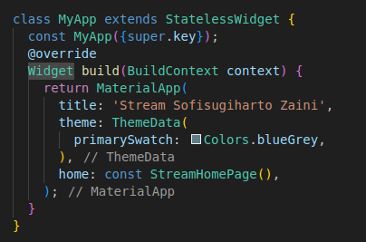

## Langkah 3: Buat file baru stream.dart

## Langkah 4: Tambah variabel colors

## Soal 2

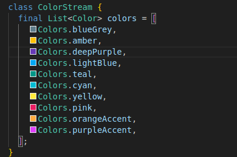

## Langkah 5: Tambah method getColors()

Di dalam class ColorStream ketik method seperti kode berikut. Perhatikan tanda bintang di akhir keyword async\* (ini digunakan untuk melakukan Stream data)
Langkah 6: Tambah perintah yield\*
Tambahkan kode berikut ini.

```
yield* Stream.periodic(
  const Duration(seconds: 1), (int t) {
    int index = t % colors.length;
    return colors[index];
});
```

## Soal 3

Jelaskan fungsi keyword yield* pada kode tersebut!
Apa maksud isi perintah kode tersebut?<br>
yield* digunakan untuk meneruskan semua nilai yang dihasilkan oleh Stream.periodic ke stream yang dihasilkan oleh fungsi getColors.Fungsi getColors menghasilkan stream yang mengeluarkan warna dari daftar colors setiap detik, dengan indeks yang berputar sehingga warna akan terus berulang. Ini berguna untuk memperbarui tampilan atau melakukan aksi berdasarkan perubahan warna.

## Langkah 7: Buka main.dart

Ketik kode impor file ini pada file main.dart

```
import 'stream.dart';
```

## Langkah 8: Tambah variabel

Ketik dua properti ini di dalam class \_StreamHomePageState

## Langkah 9: Tambah method changeColor()

```
  await for (var eventColor in colorStream.getColors()) {
      setState(() {
        bgcColor = eventColor;
      });
    }
```

## Langkah 10: Lakukan override initState()

## Langkah 11: Ubah isi Scaffold()

## Langkah 12: Run

Lakukan running pada aplikasi Flutter Anda, maka akan terlihat berubah warna background setiap detik.

## Soal 4

Capture hasil praktikum Anda berupa GIF dan lampirkan di README.<br>


## Langkah 13: Ganti isi method changeColor()

```
colorStream.getColors().listen((eventColor) {
      setState(() {
        bgcColor = eventColor;
      });
    });
```

## Soal 5

Jelaskan perbedaan menggunakan listen dan await for (langkah 9) !<br>
await for: Menunggu satu per satu. Tidak bisa melakukan hal lain sampai mendapatkan warna baru.
listen: Mendengarkan secara terus-menerus. Bisa melakukan hal lain sambil menunggu warna baru.

# Praktikum 2: Stream controllers dan sinks

## Langkah 1: Buka file stream.dart

Lakukan impor dengan mengetik kode ini.

```
import 'dart:async';
```

## Langkah 2: Tambah class NumberStream

Tetap di file stream.dart tambah class baru seperti berikut.

## Langkah 3: Tambah StreamController

Di dalam class NumberStream buatlah variabel seperti berikut.

## Langkah 4: Tambah method addNumberToSink

Tetap di class NumberStream buatlah method ini

## Langkah 5: Tambah method close()

## Langkah 6: Buka main.dart

Ketik kode import seperti berikut

## Langkah 7: Tambah variabel

Di dalam class \_StreamHomePageState ketik variabel berikut

```
 int lastNumber = 0;
  late StreamController numberStreamController;
  late NumberStream numberStream;
```

## Langkah 8: Edit initState()

```
void initState() {
    numberStream = NumberStream();
    numberStreamController = numberStream.controller;
    Stream stream = numberStreamController.stream;
    stream.listen((event) {
      setState(() {
        lastNumber = event;
      });
    });
    super.initState();
  }
```

## Langkah 9: Edit dispose()

```
  @override
  void dispose() {
    numberStreamController.close();
    super.dispose();
  }
```

## Langkah 10: Tambah method addRandomNumber()

```
void addRandomNumber() {
  Random random = Random();
  int myNum = random.nextInt(10);
  numberStream.addNumberToSink(myNum);
}
```

## Langkah 11: Edit method build()

```
body: SizedBox(
          width: double.infinity,
          child: Column(
            mainAxisAlignment: MainAxisAlignment.spaceEvenly,
            crossAxisAlignment: CrossAxisAlignment.center,
            children: [
              Text(lastNumber.toString()),
              ElevatedButton(
                  onPressed: () => addRandomNumber(),
                  child: const Text("New Random Number")),
            ],
          ),
        );
```

## Langkah 12: Run

Lakukan running pada aplikasi Flutter Anda, maka akan terlihat seperti gambar berikut.<br>


## Soal 6

Jelaskan maksud kode langkah 8 dan 10 tersebut!
Capture hasil praktikum Anda berupa GIF dan lampirkan di README.
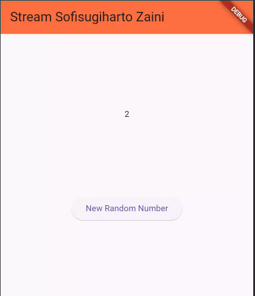<br>
Langkah 8 membuat instance NumberStream , dan streamcontroller digunakan untuk mendengarkan data yang masuk. Setiap kali ada angka baru yang diterima dari stream, widget akan diperbarui untuk menampilkan angka tersebut dengan memanggil setState.Langkah 10 addRandomNumberbertugas untuk menghasilkan angka acak dan menambahkannya ke dalam stream yang dikelola oleh numberStream

## Langkah 13: Buka stream.dart

Tambahkan method berikut ini.

## Langkah 14: Buka main.dart

Tambahkan method onError di dalam class StreamHomePageState pada method listen di fungsi initState() seperti berikut ini.

```
stream.listen((event) {
      setState(() {
        lastNumber = event;
      });
    }).onError((error) {
      setState(() {
        lastNumber = -1;
      });
    });
```

## Langkah 15: Edit method addRandomNumber()

Lakukan comment pada dua baris kode berikut, lalu ketik kode seperti berikut ini.<br>
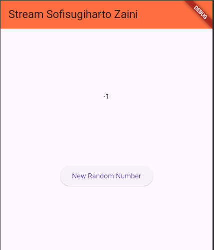

## Soal 7

Jelaskan maksud kode langkah 13 sampai 15 tersebut!
Kembalikan kode seperti semula pada Langkah 15, comment addError() agar Anda dapat melanjutkan ke praktikum 3 berikutnya.<br>
addError() untuk mengirimkan informasi kesalahan ke dalam sebuah stream yang dikelola oleh StreamController.dan pada addRandomNumber mengambil fungsi addError dari numberStream

# Praktikum 3: Injeksi data ke streams

## Langkah 1: Buka main.dart

Tambahkan variabel baru di dalam class \_StreamHomePageState

## Langkah 2: Tambahkan kode ini di initState

```
 transformer = StreamTransformer<int, int>.fromHandlers(
        handleData: (value, sink) {
          sink.add(value * 10);
        },
        handleError: (error, trace, sink) {
          sink.add(-1);
        },
        handleDone: (sink) => sink.close());
```

## Langkah 3: Tetap di initState

```
stream.transform(transformer).listen((event) {
      setState(() {
        lastNumber = event;
      });
    }).onError((error) {
      setState(() {
        lastNumber = -1;
      });
    });
    super.initState();
```

## Langkah 4: Run

Terakhir, run atau tekan F5 untuk melihat hasilnya jika memang belum running. Bisa juga lakukan hot restart jika aplikasi sudah running. Maka hasilnya akan seperti gambar berikut ini. Anda akan melihat tampilan angka dari 0 hingga 90.<br>
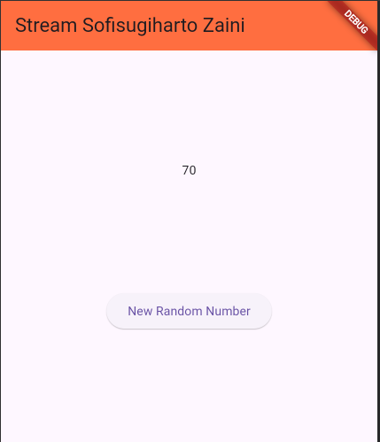

## Soal 8

Jelaskan maksud kode langkah 1-3 tersebut!<br>
<br>

<li>Membuat StreamTransformer untuk mengolah aliran data (stream) yang berisi angka bulat (int).
<li>handleData: Mengalikan setiap angka yang diterima dengan 10 dan mengirimkan hasilnya ke output.
<li>handleError: Jika terjadi kesalahan, mengirimkan -1 ke output.
<li>handleDone: Menutup output ketika tidak ada lagi data yang akan dikirim.
<li>Menerapkan transformer pada stream yang sudah ada.
<li>Menggunakan listen untuk berlangganan pada stream yang telah diubah.
<li>Memperbarui variabel lastNumber dengan hasil yang diproses dari stream.
<li>Menangani kesalahan dengan onError, yang akan mengubah lastNumber menjadi -1 jika terjadi kesalahan.

# Praktikum 4: Subscribe ke stream events

## Langkah 1: Tambah variabel

Tambahkan variabel berikut di class \_StreamHomePageState

## Langkah 2: Edit initState()

Edit kode seperti berikut ini.

```
numberStream = NumberStream();
    numberStreamController = numberStream.controller;
    Stream stream = numberStreamController.stream;
    subscription = stream.listen((event) {
      setState(() {
        lastNumber = event;
      });
    });
```

## Langkah 3: Tetap di initState()

Tambahkan kode berikut ini.

```
subscription.onError((error) {
      setState(() {
        lastNumber = -1;
      });
    });
```

## Langkah 4: Tambah properti onDone()

Tambahkan dibawahnya kode ini setelah onError

```
 subscription.onDone(() {
      print('OnDone was called');
    });
```

## Langkah 5: Tambah method baru

Ketik method ini di dalam class \_StreamHomePageState

```
void stopStream() {
    numberStreamController.close();
  }
```

## Langkah 6: Pindah ke method dispose()

Jika method dispose() belum ada, Anda dapat mengetiknya dan dibuat override. Ketik kode ini didalamnya.

```
subscription.cancel();
```

## Langkah 7: Pindah ke method build()

Tambahkan button kedua dengan isi kode seperti berikut ini.

```
 ElevatedButton(
                  onPressed: () => stopStream(),
                  child: const Text("Stop Subscription")),
```

## Langkah 8: Edit method addRandomNumber()

Edit kode seperti berikut ini.

```
void addRandomNumber() {
    Random random = Random();
    int myNum = random.nextInt(10);

    if (!numberStreamController.isClosed) {
      numberStream.addNumberToSink(myNum);
    } else {
      setState(() {
        lastNumber = -1;
      });
    }
```

## Langkah 9: Run

Anda akan melihat dua button seperti gambar berikut.

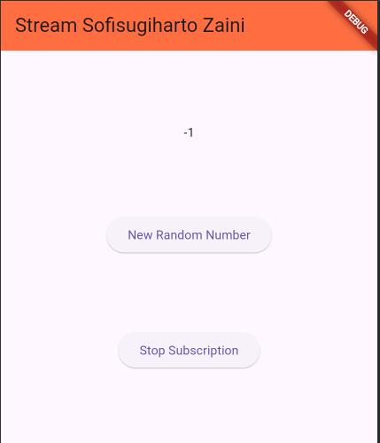

## Langkah 10: Tekan button ‘Stop Subscription'

Anda akan melihat pesan di Debug Console seperti berikut.
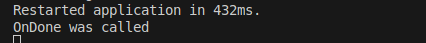

## Soal 9

Jelaskan maksud kode langkah 2, 6 dan 8 tersebut!<br>
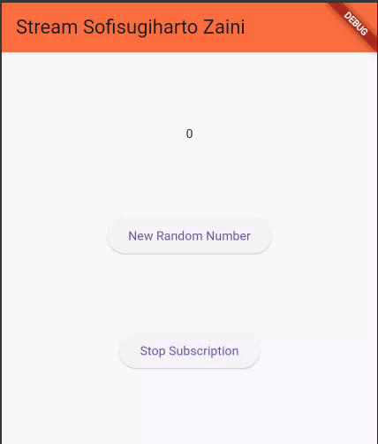
Di init state mengatur aliran angka dari NumberStream, mendengarkan angka-angka tersebut, dan memperbarui tampilan aplikasi setiap kali angka baru diterima.subscription.cancel() digunakan untuk membatalkan subscription dan addRandomNumber () digunakan untuk menambahkan angka acak ke dalam stream jika stream tidak ditutup tetapi jika ditutup maka tampil angka -1

# Praktikum 5: Multiple stream subscriptions

## Langkah 1: Buka file main.dart

Ketik variabel berikut di class \_StreamHomePageState

```
late StreamSubscription subscription2;
  String values = '';
```

## Langkah 2: Edit initState()

Ketik kode seperti berikut.

```
subscription = stream.listen((event) {
      setState(() {
        values += '$event - ';
      });
    });
    subscription2 = stream.listen((event) {
      setState(() {
        values += '$event - ';
      });
    });
```

## Langkah 3: Run

Lakukan run maka akan tampil error seperti gambar berikut.<br>
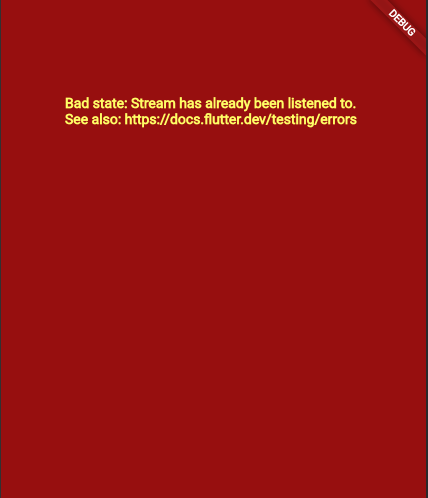

## Soal 10

Jelaskan mengapa error itu bisa terjadi ?<br>
Karena Flutter tidak mengizinkan satu stream untuk didengarkan lebih dari sekali, kecuali kalau stream tersebut diubah menjadi "broadcast stream".

## Langkah 4: Set broadcast stream

Ketik kode seperti berikut di method initState()

```
numberStream = NumberStream();
    numberStreamController = numberStream.controller;
    Stream stream = numberStreamController.stream.asBroadcastStream();
```

## Langkah 5: Edit method build()

Tambahkan text seperti berikut

```
child: Column(
            mainAxisAlignment: MainAxisAlignment.spaceEvenly,
            crossAxisAlignment: CrossAxisAlignment.center,
            children: [
              Text(values),
```

## Langkah 6: Run

Tekan button ‘New Random Number' beberapa kali, maka akan tampil teks angka terus bertambah sebanyak dua kali.
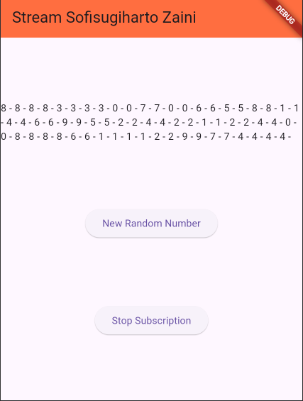

## Soal 11

Jelaskan mengapa hal itu bisa terjadi ?<bt>
Karena stream di set menjadi broadcast sehingga memungkinkan kita untuk subscribe stream yang sama beberapa kali.Dan pada kasus itu stream didengarkan 2 kali maka akan muncul data sebanyak 2 kali.<br>


# Praktikum 6: StreamBuilder

## Langkah 1: Buat Project Baru

## Langkah 2: Buat file baru stream.dart

Ketik kode ini

## Langkah 3: Tetap di file stream.dart

Ketik kode seperti berikut.

```
class NumberStream {
  Stream<int> getNumbers() async* {
    {
      yield* Stream.periodic(const Duration(seconds: 1), (int t) {
        Random random = Random();
        int myNum = random.nextInt(10);
        return myNum;
      });
    }
  }
}
```

## Langkah 4: Edit main.dart

## Langkah 5: Tambah variabel

Di dalam class \_StreamHomePageState, ketika variabel ini.

## Langkah 6: Edit initState()

Ketik kode seperti berikut.

```
numberStream = NumberStream().getNumbers();
    super.initState();
```

## Langkah 7: Edit build()

```
 StreamBuilder(
          stream: numberStream,
          initialData: 0,
          builder: (context, snapshot) {
            if (snapshot.hasError) {
              print("Error");
            }
            if (snapshot.hasData) {
              return Center(
                child: Text(
                  snapshot.data.toString(),
                  style: const TextStyle(fontSize: 96),
                ),
              );
            } else {
              return const SizedBox.shrink();
            }
          },
        )
```

## Langkah 8: Run

Hasilnya, setiap detik akan tampil angka baru seperti berikut.<br>


## Soal 12

Jelaskan maksud kode pada langkah 3 dan 7 !<br>
Class NumberStream yang memiliki metode getNumbers(). Metode ini menghasilkan aliran angka bulat acak antara 0 hingga 9 setiap detik menggunakan Stream.periodic. Dengan demikian, pengguna dapat menerima angka acak secara otomatis dan berkala.Dan kode kode StreamBuilder membuat tampilan yang secara otomatis memperbarui angka yang ditampilkan setiap kali angka baru diterima dari stream numberStream. Jika terjadi kesalahan, akan mencetak "Error" di konsol, dan jika tidak ada data yang diterima, tidak akan menampilkan apa pun

# Praktikum 7: BLoC Pattern

## Langkah 1: Buat Project baru

Buatlah sebuah project flutter baru dengan nama bloc_random_nama (beri nama panggilan Anda) di folder week-13/src/ repository GitHub Anda. Lalu buat file baru di folder lib dengan nama random_bloc.dart

## Langkah 2: Isi kode random_bloc.dart

```
import 'dart:async';
import 'dart:math';
```

## Langkah 3: Buat class RandomNumberBloc()

## Langkah 4: Buat variabel StreamController

Di dalam class RandomNumberBloc() ketik variabel berikut ini

```
final _generateRandomController = StreamController<void>();
  final _randomNumberController = StreamController<int>();
  Sink<void> get generateRandom => _generateRandomController.sink;
  Stream<int> get randomNumber => _randomNumberController.stream;
   _secondsStreamController.sink;
```

## Langkah 5: Buat constructor

```
RandomNumberBloc() {
    _generateRandomController.stream.listen((_) {
      final random = Random().nextInt(10);
      _randomNumberController.sink.add(random);
    });
  }
```

## Langkah 6: Buat method dispose()

```
void dispose() {
    _generateRandomController.close();
    _randomNumberController.close();
  }
```

## Langkah 7: Edit main.dart

## Langkah 8: Buat file baru random_screen.dart

## Langkah 9: Lakukan impor material dan random_bloc.dart

## Langkah 10: Buat StatefulWidget RandomScreen

## Langkah 11: Buat variabel

Ketik kode ini di dalam class \_RandomScreenState

```
final _bloc = RandomNumberBloc();
```

## Langkah 12: Buat method dispose()

Ketik kode ini di dalam class \_StreamHomePageState

```
 @override
  void dispose() {
    _bloc.dispose();
    super.dispose();
  }
```

## Langkah 13: Edit method build()

Ketik kode ini di dalam class \_StreamHomePageState

```
 @override
  Widget build(BuildContext context) {
    return Scaffold(
      appBar: AppBar(title: const Text('Random Number')),
      body: Center(
        child: StreamBuilder<int>(
          stream: _bloc.randomNumber,
          initialData: 0,
          builder: (context, snapshot) {
            return Text(
              'Random Number: ${snapshot.data}',
              style: const TextStyle(fontSize: 24),
            );
          },
        ),
      ),
      floatingActionButton: FloatingActionButton(
        onPressed: () => _bloc.generateRandom.add(null),
        child: const Icon(Icons.refresh),
      ),
    );
  }
```

## Soal 13

Jelaskan maksud praktikum ini ! Dimanakah letak konsep pola BLoC-nya ?<br>

<li>Class RandomNumberBloc: Ini adalah komponen BLoC yang memisahkan logika pembuatan angka acak dari UI. Di sini, \_generateRandomController digunakan untuk menerima perintah dari UI, dan \_randomNumberController untuk mengirimkan data angka acak ke UI.

<li>Stream dan Sink:
generateRandom adalah sink yang menerima event dari tombol di UI untuk memicu pembuatan angka acak.
randomNumber adalah stream yang mengirimkan angka acak hasil ke UI.
<li>Listen Stream: Dalam konstruktor RandomNumberBloc, stream.listen digunakan untuk mendengarkan perintah dari sink generateRandom. Setiap kali menerima perintah, angka acak dihasilkan dan dikirimkan melalui randomNumber.

<li>dispose Method: Menutup controller untuk menghindari kebocoran memori.

<li>UI (RandomScreen): Menggunakan StreamBuilder untuk mendengarkan perubahan pada randomNumber. Setiap kali data baru diterima, UI diperbarui dengan angka acak terbaru.<br>

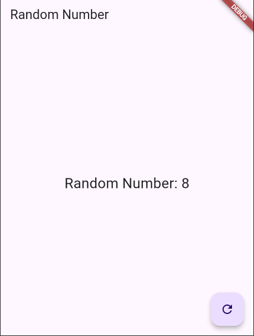
