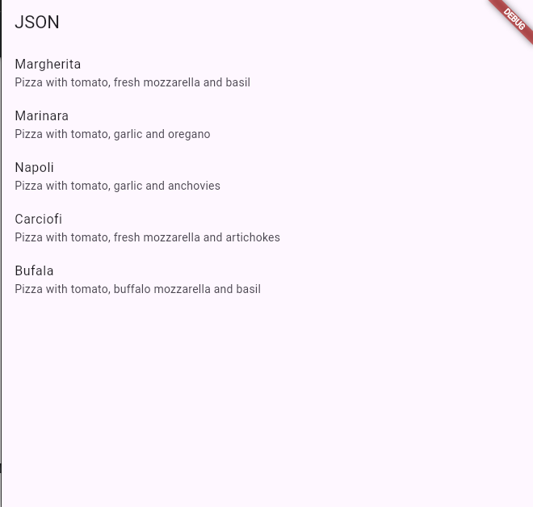

# A. Praktikum 1: Converting Dart models into JSON

## 1. Di editor favorit Anda, buat proyek Flutter baru dan beri nama store_data

## 2. Pada file main.dart, hapus kode yang ada dan tambahkan kode awal untuk aplikasi dengan kode

berikut:

```

void main() {
  runApp(const MyApp());
}

class MyApp extends StatelessWidget {
  const MyApp({super.key});
  @override
  Widget build(BuildContext context) {
    return MaterialApp(
      title: 'Flutter JSON Demo',
      theme: ThemeData(
        primarySwatch: Colors.blue,
      ),
      home: const MyHomePage(),
    );
  }
}

class MyHomePage extends StatefulWidget {
  const MyHomePage({super.key});

  @override
  State<MyHomePage> createState() => _MyHomePageState();
}

class _MyHomePageState extends State<MyHomePage> {
  String pizzaString = '';

  @override
  void initState() {
    // TODO: implement initState
    super.initState();
    readJsonFile();
  }

  @override
  Widget build(BuildContext context) {
    // TODO: implement build
    return Scaffold(
      appBar: AppBar(
        title: const Text('JSON'),
      ),
      body: Text(pizzaString),
    );
  }
}
```

## 3. Tambahkan folder baru ke root proyek Anda dengan nama assets.

## 4. Di dalam folder aset, buat file baru bernama pizzalist.json dan salin konten yang tersedia di tautan

https://gist.github.com/simoales/a33c1c2abe78b48a75ccfd5fa0de0620. File ini berisi daftar objek
JSON.

## 5. Di file pubspec.yaml, tambahkan referensi ke folder aset baru,

## 6. Pada kelas \_MyHomePageState, di main.dart, tambahkan sebuah variabel state bernama

pizzaString:

## 7. Untuk membaca isi file pizzalist.json, di bagian bawah kelas \_MyHomePageState di main.dart,

```
 Future readJsonFile() async {
    String myString = await DefaultAssetBundle.of(context)
        .loadString('assets/pizzalist.json');
    setState(() {
      pizzaString = myString;
    });
  }
```

## 8. Pada kelas \_MyHomePageState, timpa metode initState dan, di dalamnya, panggil metode readJsonFile

## 9. Sekarang, kita ingin menampilkan JSON yang diambil di properti dalam Scaffold. Untuk melakukannya, tambahkan widget Teks sebagai child dari Container kita:

## 10. Mari kita jalankan aplikasinya. Jika semuanya berjalan seperti yang diharapkan, Anda akan melihat konten file JSON di layar


## 11. Kita ingin mengubah String ini menjadi sebuah List of Objects.

Kita akan mulai dengan membuat
kelas baru. Dalam folder lib aplikasi kita, buat file baru bernama pizza.dart.

## 12. Di dalam file tersebut, tentukan properti kelas Pizza

```
class Pizza {
  final int id;
  final String pizzaName;
  final String description;
  final double price;
  final String imageUrl;
}
```

## 13. Di dalam kelas Pizza, tentukan konstruktor bernama fromJson, yang akan mengambil sebuah Map sebagai parameter dan mengubah Map menjadi sebuah instance dari Pizza:

```
Pizza.fromJson(Map<String,dynamic>json) :
    id=json['id'],
    pizzaName=json['pizzaName],
    description =json['description'],
    price=json['price],
    imageUrl=json['imageUrl'];
```

## 14. Refaktor metode readJsonFile() pada kelas \_MyHomePageState. Langkah pertama adalah mengubah String menjadi Map dengan memanggil metode jsonDecode. Pada method readJsonFile,tambahkan kode yang di cetak tebal berikut ini:

```
Future readJsonnFile() async {
String myString = await DefaultAssetBundle.of(context)
.loadString('assets/pizzalist.json');
List pizzaMapList = jsonDecode(myString);
}
```

## 15.Pastikan editor Anda secara otomatis menambahkan pernyataan impor untuk pustaka "dart:convert" di bagian atas file main.dart; jika tidak, tambahkan saja secara manual. Tambahkan juga pernyataan impor untuk kelas pizza:

## 16. Langkah terakhir adalah mengonversi string JSON kita menjadi List of native Dart objects.

Kita dapat melakukan ini dengan mengulang pizzaMapList dan mengubahnya menjadi objek Pizza. Di
dalam metode readJsonFile, di bawah metode jsonDecode, tambahkan kode berikut:

```
 List<Pizza> myPizzas = [];
    for (var pizza in pizzaMapList) {
      Pizza myPizza = Pizza.fromJson(pizza);
      myPizzas.add(myPizza);
    }
    return myPizzas;
```

## 17.Hapus atau beri komentar pada metode setState yang mengatur String pizzaString dan kembalikan daftar objek Pizza sebagai gantinya:

```
return myPizzas
```

## 18. Ubah signature metode sehingga Anda dapat menampilkan nilai balik secara explisit :

```
Future<List<Pizza>> readJsonFile() async {
```

## 19. Sekarang kita memiliki objek List of Pizza.

Daripada hanya menampilkan sebuah Teks kepada
pengguna, kita dapat menampilkan sebuah ListView yang berisi sekumpulan widget ListTile. Di
bagian atas kelas \_MyHomePageState, buat List<Pizza> bernama myPizzas:

## 20. Dalam metode initState, pastikan Anda mengatur myPizzas dengan hasil panggilan ke readJsonFile:

```
@override
  void initState() {
    // TODO: implement initState
    super.initState();
    readJsonFile().then((value) {
      setState(() {
        myPizzas = value;
      });
    });
  }
```

## 21. Tambahkan kode berikut ini di dalam Scaffold, di dalam metode build():

```
 body: ListView.builder(
          itemCount: myPizzas.length,
          itemBuilder: (context, index) {
            return ListTile(
              title: Text(myPizzas[index].pizzaName),
              subtitle: Text(myPizzas[index].description),
            );
          }),
    );
```

## 22. Jalankan aplikasi. Antarmuka pengguna sekarang seharusnya jauh lebih ramah dan terlihat seperti yang ditunjukkan pada



# B. Praktikum 2: Reading the JSON file

## 1. Tambahkan metode baru ke kelas Pizza, di file pizza.dart, yang disebut toJson. Ini akan mengembalikan sebuah Map<String, dynamic> dari objek:

```
Map<String, dynamic> toJson() {
    return {
      'id': id,
      'pizzaName': pizzaName,
      'description': description,
      'price': price,
      'imageUrl': imageUrl
    };
```

## 2. Setelah Anda memiliki sebuah Map, Anda dapat menserialisasikannya kembali ke dalam string JSON.

Tambahkan metode baru di di bagian bawah kelas \_MyHomePageState, di dalam file
main.dart, yang disebut convertToJSON:

```
 String convertToJSON(List<Pizza> pizzas) {
    return jsonEncode(pizzas.map((pizza) => jsonEncode(pizza)).toList());
  }
```

## 3. Metode ini mengubah objek List of Pizza kembali menjadi string Json dengan memanggil metode jsonEncode lagi di pustaka dart_convert.

## 4. Terakhir, mari panggil metode tersebut dan cetak string JSON di Debug Console. Tambahkan kode berikut ke metode readJsonFile, tepat sebelum mengembalikan List myPizzas:

```
    String json = convertToJSON(myPizzas);
    print(json);
    return myPizzas;
```

## 5. Jalankan aplikasi. Anda akan melihat string JSON dicetak, seperti yang ditunjukkan pada gambar berikut:


# C. Praktikum 3: Saving data simply with SharedPreferences

## 1. Gunakan project pada pertemuan 11 bernama books. Pertama, tambahkan ketergantungan pada shared_preferences. Dari Terminal Anda, ketikkan perintah berikut

## 2. Untuk memperbarui dependensi dalam proyek Anda, jalankan perintah flutter pub get dari jendela Terminal.

## 3. Di bagian atas file main.dart, impor shared_preferences:

## 4. Di bagian atas kelas \_MyHomePageState, buat variabel status integer baru bernama appCounter:

## 5. Dalam kelas \_MyHomePageState, buat metode asinkron baru yang disebut readAndWritePreferences():

## 6. Di dalam metode readAndWritePreference, buatlah sebuah instance dari SharedPreferences:

```
 SharedPreferences prefs = await SharedPreferences.getInstance();
```

## 7. Setelah membuat instance preferensi, kita membuat kode yang mencoba baca nilai kunci appCounter. Jika nilainya nol, setel ke 0; lalu naikkan nilainya:

```
 appCounter = prefs.getInt('appCounter') ?? 0;
    appCounter++;
```

## 8. Setelah itu, atur nilai kunci appCounter di preferensi ke nilai baru:

```
await prefs.setInt('appCounter', appCounter);
```

## 9. Memperbarui nilai status appCounter:

```
 setState(() {
      appCounter = appCounter;
    });
```

## 10. Pada metode initState di kelas \_MyHomePageState, panggil metode readAndWritePreference() dengan kode yang dicetak tebal:

```
@override
  void initState() {
    super.initState();
    readAndWritePreference();
  }
```

## 11. Dalam metode build, tambahkan kode berikut ini di dalam widget Container:

```
Center(
          child: Column(
            mainAxisAlignment: MainAxisAlignment.spaceEvenly,
            children: [
              Text('You have opened the app $appCounter times.'),
              ElevatedButton(
                onPressed: () {},
                child: const Text('Reset Counter'),
              )
            ],
          ),
```

## 12.Jalankan aplikasi. Saat pertama kali membukanya, Anda akan melihat layar yang mirip dengan yang berikut ini:


## 13. Tambahkan metode baru ke kelas \_MyHomePageState yang disebut deletePreference(), yang akan menghapus nilai yang disimpan:

```
Future deletePreference() async {
    SharedPreferences prefs = await SharedPreferences.getInstance();
    await prefs.clear();
    setState(() {
      appCounter = 0;
    });
  }
```

## 14. Dari properti onPressed dari widget ElevatedButton di metode build(), memanggil metode deletePreference(), dengan kode di cetak tebal:

```
 ElevatedButton(
                onPressed: () {
                  deletePreference();
                },
                child: const Text('Reset Counter'),
              )
```


