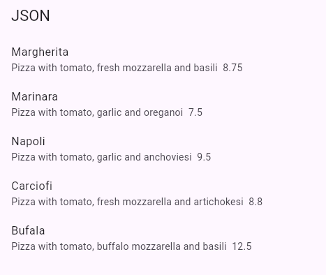
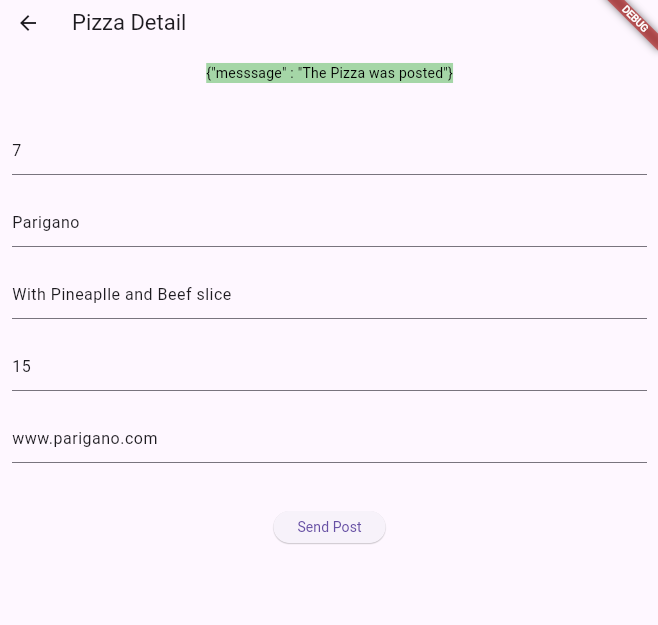
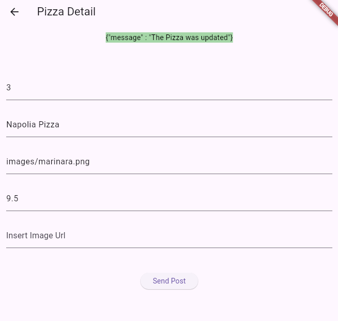
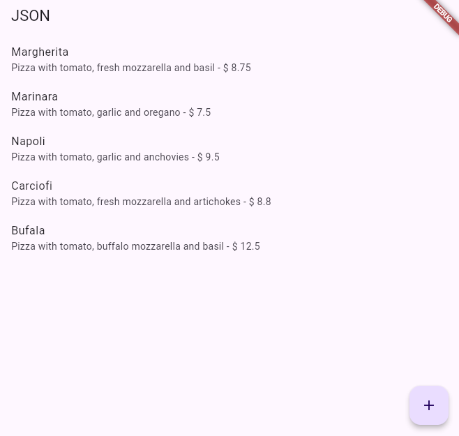
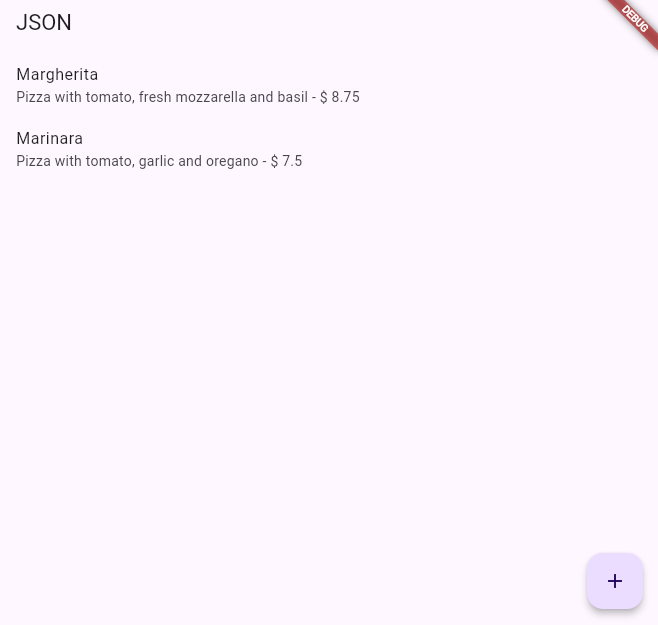

# A. Praktikum 1, Designing an HTTP client and getting data

## 1. Mendaftarlah ke layanan Lab Mock di https://app.wiremock.cloud/. Bisa anda gunakanakun google untuk mendaftar. Jika berhasil bendaftar dan login, akan muncul seperti gambar berikut.

## 2.Di halaman dahsboard, klik menu Stubs, kemudian klik entri pertama yaitu “GET a JSON resource”. Anda akan melihat layar yang mirip dengan berikut

## 3. Klik “Create new stub”. Di kolom sebelah kanan, lengkapi data berikut. Namanya adalah“Pizza List”, kemudian pilih GET dan isi dengan “/pizzalist”.

Kemudian, pada bagian
Response, untuk status 200, kemudian pada Body pilih JSON sebagai formatnya dan isi
konten JSON dari https://bit.ly/pizzalist. Perhatikan gambar berikut.

## 4.Tekan tombol SAVE di bagian bawah halaman untuk menyimpan Mock ini. Jika berhasil tersimpan, maka Mock API sudah siap digunakan.

## 5. Buatlah project flutter baru dengan nama pizza_api_nama_anda, tambahkan depedensi “http” melalui terminal

## 6. DI folder “lib” project anda, tambahkan file dengan nama “httphelper.dart”

## 7. Isi httphelper.dart dengan kode berikut. Ubah “02z2g.mocklab.io” dengan URL Mock API anda.

```
import 'dart:io';
import 'package:flutter_basic/models/pizza.dart';
import 'package:http/http.dart' as http;
import 'dart:convert';
import 'models/pizza.dart';

class Httphelper {
  final String authority = "https://wm89g.wiremockapi.cloud/";
  final String path = "pizzalist";

  Future<List<Pizza>> getPizzaList() async {
    final Uri url = Uri.parse(authority + path);
    final http.Response result = await http.get(url);
    if (result.statusCode == HttpStatus.ok) {
      final jsonResponse = jsonDecode(result.body);
      final List<Pizza> pizzas =
          jsonResponse.map<Pizza>((i) => Pizza.fromJson(i)).toList();

      return pizzas;
    } else {
      return [];
    }
  }
}

```

## 8. Di file “main.dart”, di class \_ MyHomePageState, tambahkan metode bernama“callPizzas”.

Metode ini mengembalikan sebuah Future dari daftar objek Pizza dengan
memanggil metode getPizzaList dari kelas HttpHelper, dengan kode sebagai berikut:

```
Future<List<Pizza>> callPizzas() async {
    Httphelper helper = Httphelper();
    List<Pizza> pizzas = await helper.getPizzaList();
    return pizzas;
  }
```

## 9. Di class \_MyHomePageState, e, di dalam body Scaffold, tambahkan FutureBuilder yang membuat ListView dari widget ListTile yang berisi objek Pizza:

```
 Widget build(BuildContext context) {
    return Scaffold(
      appBar: AppBar(
        title: const Text('JSON'),
      ),
      body: FutureBuilder(
          future: callPizzas(),
          builder: (BuildContext context, AsyncSnapshot<List<Pizza>> snapshot) {
            if (snapshot.hasError) {
              return const Text('Sometging when wrong');
            } else if (!snapshot.hasData) {
              return const CircularProgressIndicator();
            }
            return ListView.builder(
                itemCount: (snapshot.data == null) ? 0 : snapshot.data!.length,
                itemBuilder: (BuildContext context, int position) {
                  return ListTile(
                    title: Text(snapshot.data![position].pizzaName),
                    subtitle: Text(
                        '${snapshot.data![position].description}i  ${snapshot.data![position].price}'),
                  );
                });
          }),
    );
  }
```

## 10. Jalankan aplikasi. Anda akan melihat layar yang mirip dengan berikut ini:



# Praktikum 2. POST-ing data

## 1. Masuk ke layanan Lab Mock di https://app.wiremock.cloud/ dan klik bagian Stubs,kemudian, buatlah stub baru.

## 2. Lengkapi isian seperti gambar berikut:

## 3.Simpan

## 4.Di proyek Flutter, di file httpHelper.dart, di kelas HttpHelper, buat metode baru bernama postPizza, lengkapi kode sebagai berikut.

```
Future<String> postPizza(Pizza pizza) async {
    const postPath = "/pizza";
    String post = json.encode(pizza.toJson());
    final Uri url = Uri.parse(authority + postPath);
    final http.Response result = await http.post(url, body: post);
    return result.body;
  }
```

## 5.Di dalam proyek, buat sebuah file baru bernama pizza_detail.dart.

## 6. 6. Di bagian atas file baru, tambahkan impor yang diperlukan.

```
import 'package:flutter/material.dart';
import 'models/pizza.dart';
import 'httphelper.dart';

```

## 7. Buat StatefulWidget bernama PizzaDetailScreen.

```
class PizzaDetailScreen extends StatefulWidget {
  const PizzaDetailScreen({super.key});
  @override
  State<PizzaDetailScreen> createState() => _PizzaDetailScreenState();
}

class _PizzaDetailScreenState extends State<PizzaDetailScreen> {
  @override
  Widget build(BuildContext context) {
    // TODO: implement build
    return Placeholder();
  }
}
```

## 8. Di bagian atas kelas \_PizzaDetailScreenState, tambahkan lima widgetTextEditingController.

Widget ini akan berisi data untuk objek Pizza yang akan diposting
nanti. Juga, tambahkan sebuah String yang akan berisi hasil dari permintaan POST.

```
  final TextEditingController txtId = TextEditingController();
  final TextEditingController txtName = TextEditingController();
  final TextEditingController txtPrice = TextEditingController();
  final TextEditingController txtDescription = TextEditingController();
  final TextEditingController txtImageUrl = TextEditingController();

  String operationResult = '';
```

## 9. Override metode dispose() untuk membuang controllers

```
@override
  void dispose() {
    txtId.dispose();
    txtName.dispose();
    txtPrice.dispose();
    txtDescription.dispose();
    txtImageUrl.dispose();
    super.dispose();
  }
```

## 10. Dalam metode build() pada kelas, kita return sebuah Scaffold, yang AppBar-nya berisi Teksyang menyatakan “Detail Pizza” dan Body-nya berisi Padding dan SingleChildScrollView yang berisi Column.

```
 @override
  Widget build(BuildContext context) {
    return Scaffold(
        appBar: AppBar(
          title: const Text('Pizza Detail'),
        ),
        body: Padding(
          padding: const EdgeInsets.all(12.0),
          child: SingleChildScrollView(
            child: Column(
              children: [],
            ),
          ),
        ));
  }
```

## 11. Untuk properti anak dari Column, tambahkan beberapa Text yang akan berisi hasil posting,

lima TextFields, masing-masing terikat pada TextEditingController, dan sebuah
ElevatedButton untuk menyelesaikan aksi POST (metode postPizza akan dibuat
berikutnya). Juga, tambahkan SizedBox untuk memberi jarak pada widget di layar

```
 child: Column(
              children: [
                Text(
                  operationResult,
                  style: TextStyle(
                    backgroundColor: Colors.green[200],
                    color: Colors.black,
                  ),
                ),
                const SizedBox(height: 24),
                TextField(
                    controller: txtId,
                    decoration: const InputDecoration(hintText: 'Insert Id')),
                const SizedBox(height: 24),
                TextField(
                  controller: txtName,
                  decoration:
                      const InputDecoration(hintText: 'Insert Pizza Name'),
                ),
                const SizedBox(
                  height: 24,
                ),
                TextField(
                  controller: txtDescription,
                  decoration: const InputDecoration(
                      hintText: 'Insert Pizza Description'),
                ),
                const SizedBox(
                  height: 24,
                ),
                TextField(
                  controller: txtPrice,
                  decoration: const InputDecoration(hintText: "Insert Price"),
                ),
                const SizedBox(height: 24),
                TextField(
                  controller: txtImageUrl,
                  decoration:
                      const InputDecoration(hintText: 'Insert Image Url'),
                ),
                const SizedBox(
                  height: 48,
                ),
                ElevatedButton(
                    child: const Text('Send Post'),
                    onPressed: () {
                      postPizza();
                    })
              ],
            ),
```

## 12. Di bagian bawah kelas \_PizzaDetailState, tambahkan metode postPizza

```
 Future postPizza() async {
    Httphelper helper = Httphelper();
    int id = int.parse(txtId.text);
    String pizzaName = txtName.text;
    double price = double.parse(txtPrice.text);
    String description = txtDescription.text;
    String imageUrl = txtImageUrl.text;
    Pizza pizza = Pizza(id, pizzaName, description, price, imageUrl);
    String result = await helper.postPizza(pizza);
    setState(() {
      operationResult = result;
    });
  }
```

## 13. Di file main.dart, impor file pizza_detail.dart.

## 14. Di perancah metode build() dari kelas \_MyHomePageState,

tambahkan
FloatingActionButton yang akan menavigasi ke rute PizzaDetail.

```
 floatingActionButton: FloatingActionButton(
        child: const Icon(Icons.add),
        onPressed: () {
          Navigator.push(
            context,
            MaterialPageRoute(builder: (context) => const PizzaDetailScreen()),
          );
        },
      ),
```

## 15. Jalankan aplikasi. Pada layar utama, tekan FloatingActionButton untuk menavigasi ke rute PizzaDetail

## 16. Tambahkan detail pizza di kolom teks dan tekan tombol Kirim Postingan. Anda akan melihat hasil yang berhasil, seperti yang ditunjukkan pada gambar berikut.



# C. Praktikum 3, PUT-ting data

## 1. Masuk ke layanan Lab Mock di https://app.wiremock.cloud/ dan klik bagian Stubs,

kemudian, buatlah stub baru.

## 2. Lengkapi isian seperti gambar berikut:

## 3. Simpan

## 4. Di proyek Flutter, tambahkan metode putPizza ke kelas HttpHelper di file http_helper.dart

```
 Future<String> putPizza(Pizza pizza) async {
    const putPath = "pizza";
    String put = json.encode(pizza.toJson());
    final Uri url = Uri.parse(authority + putPath);
    final http.Response result = await http.put(url, body: put);
    return result.body;
  }
```

## 5. Di kelas PizzaDetailScreen di file pizza_detail.dart, tambahkan dua properti, Pizza dan boolean, dan di konstruktor, atur dua properti tersebut

```
 final Pizza pizza;
  final bool isNew;

  const PizzaDetailScreen(
      {super.key, required this.pizza, required this.isNew});
```

## 6. Di kelas PizzaDetailScreenState, override metode initState.

Bila properti isNew dari kelas
PizzaDetail tidak baru, properti ini akan menetapkan konten TextFields dengan nilai objek
Pizza yang dilewatkan

```
 @override
  void initState() {
    if (!widget.isNew) {
      txtId.text = widget.pizza.id.toString();
      txtName.text = widget.pizza.pizzaName;
      txtPrice.text = widget.pizza.description;
      txtPrice.text = widget.pizza.price.toString();
      txtDescription.text = widget.pizza.imageUrl;
    }
    super.initState();
  }
```

## 7.Edit metode savePizza sehingga memanggil metode helper.postPizza ketika properti isNew bernilai benar, dan helper.putPizza ketika bernilai salah

```
 String result =
        await (widget.isNew ? helper.postPizza(pizza) : helper.putPizza(pizza));
```

## 8.Di file main.dart, di metode build \_MyHomePageState, tambahkan properti onTap ke ListTile

sehingga saat pengguna mengetuknya, aplikasi akan mengubah rute dan
menampilkan layar PizzaDetail, dengan menampilkan data pizza yang ada saat ini dan
menjadikan false untuk parameter isNew

```
 return ListTile(
                title: Text(snapshot.data![position].pizzaName),
                subtitle: Text(
                    '${snapshot.data![position].description}  ${snapshot.data![position].price}'),
                onTap: () {
                  Navigator.push(
                      context,
                      MaterialPageRoute(
                          builder: (context) => PizzaDetailScreen(
                                pizza: snapshot.data![position],
                                isNew: false,
                              )));
                },
              );
```

## 9. Di floatingActionButton, passing data Pizza baru dan menjadikan true untuk parameter isNew ke rute PizzaDetail

```
floatingActionButton: FloatingActionButton(
        child: const Icon(Icons.add),
        onPressed: () {
          Navigator.push(
            context,
            MaterialPageRoute(
                builder: (context) => PizzaDetailScreen(
                      pizza: Pizza(
                        id: 0,
                        pizzaName: '',
                        description: '',
                        price: 0.0,
                        imageUrl: '',
                      ),
                      isNew: true,
                    )),
          );
        },
      ),
    ;
```

## 10. Jalankan aplikasi. Pada layar utama, ketuk Pizza mana pun untuk menavigasi ke rute PizzaDetail

## 11. Edit detail pizza di kolom teks dan tekan tombol Simpan. Anda akan melihat pesan yang menunjukkan bahwa detail pizza telah diperbarui



# D. Praktikum 4, DELETE-ing data

## 1. Masuk ke layanan Wiremock di https://app.wiremock.cloud dan klik pada bagian Stubs

pada contoh API. Kemudian, buatlah sebuah stub baru

## 2. Lengkapi isian, dengan data berikut:

• Name: Delete Pizza
• Verb: DELETE
• Address: /pizza
• Status: 200
• Body Type: json
• Body: {"message": "Pizza was deleted"}

## 3. Save the new stub

## 4. Di proyek Flutter, tambahkan metode deletePizza ke kelas HttpHelper di file http_helper.dart

```
Future<String> deletePizza(int id) async {
    const deletePath = "pizza";
    final Uri url = Uri.parse(authority + deletePath);
    final http.Response result = await http.delete(url);
    return result.body;
  }
```

## 5. Pada file main.dart, di metode build kelas \_MyHomePageState, refaktor itemBuilder dari ListView.builder agar ListTile terdapat dalam widget Dismissible, seperti berikut

```
 return ListView.builder(
            itemCount: (pizzas.data == null) ? 0 : pizzas.data!.length,
            itemBuilder: (BuildContext context, int position) {
              return Dismissible(
                key: Key(pizzas.data![position].id.toString()),
                onDismissed: (item) {
                  Httphelper helper = Httphelper();
                  pizzas.data!.removeWhere((element) {
                    return element.id == pizzas.data![position].id;
                  });
                  helper.deletePizza(pizzas.data![position].id);
                },
```

## 6. Jalankan aplikasi. Saat Anda menggeser elemen apa pun dari daftar pizza, ListTile akan menghilang



