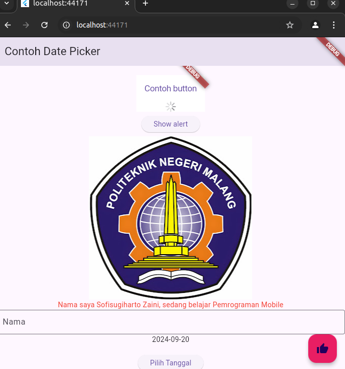

# NAMA : SOFISUGIHARTO ZAINI

# TI-3C

# ABSEN : 25

# hello_world

A new flutter project

# Soal 1

# Praktikum2

## Langkah11

## Langkah12

# Praktikum3:Menerapkan Widget Dasar

## Langkah 1: Text Widget

## Langkah 2: Image Widget

# Praktikum4:Menerapkan Widget Material Design dan iOS Cupertino

## Langkah3:Scaffold Widget

## Langkah4:Dialog Widget

## Langkah5:Input dan Selection Widget

## Langkah 6: Date and Time Pickers

# Soal2

