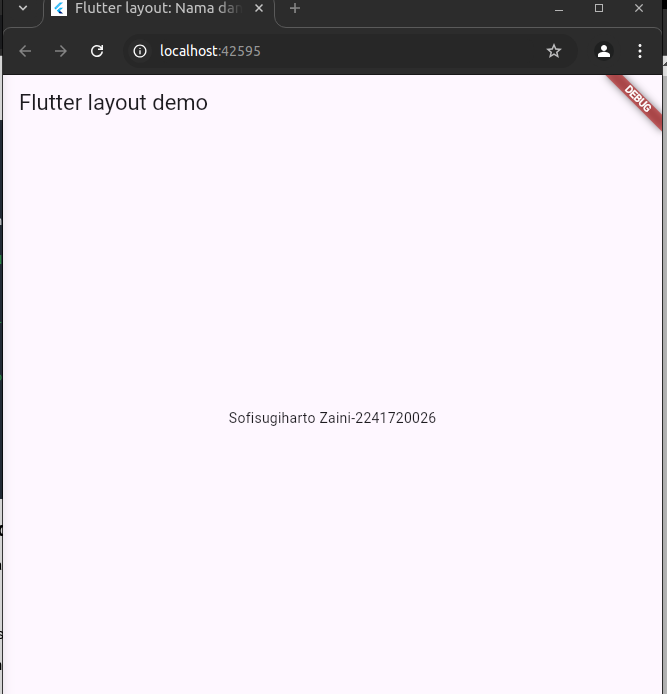
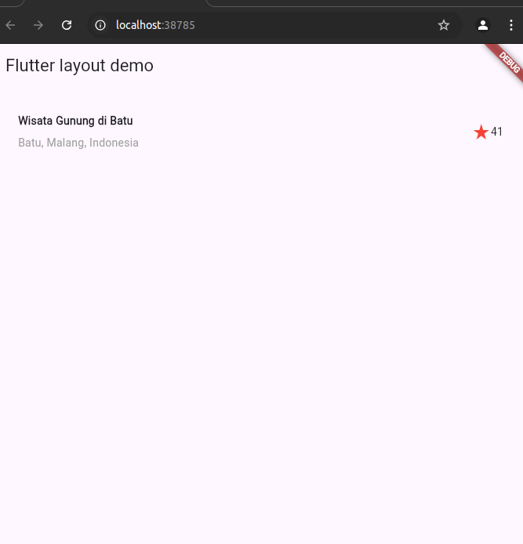
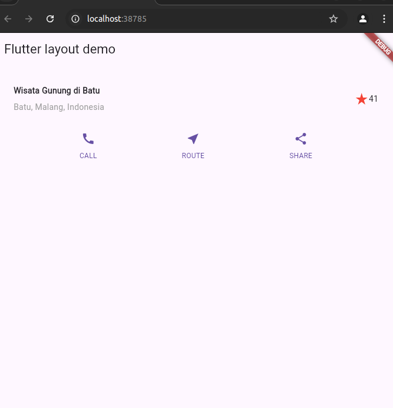
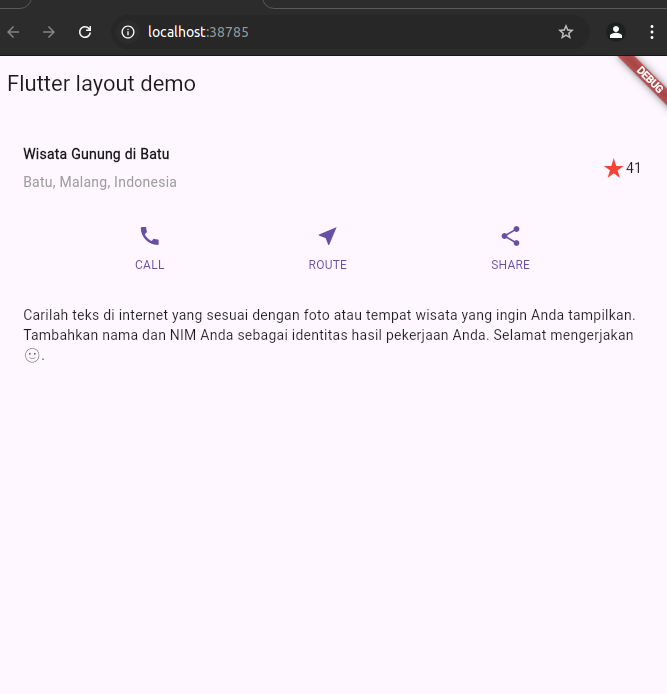
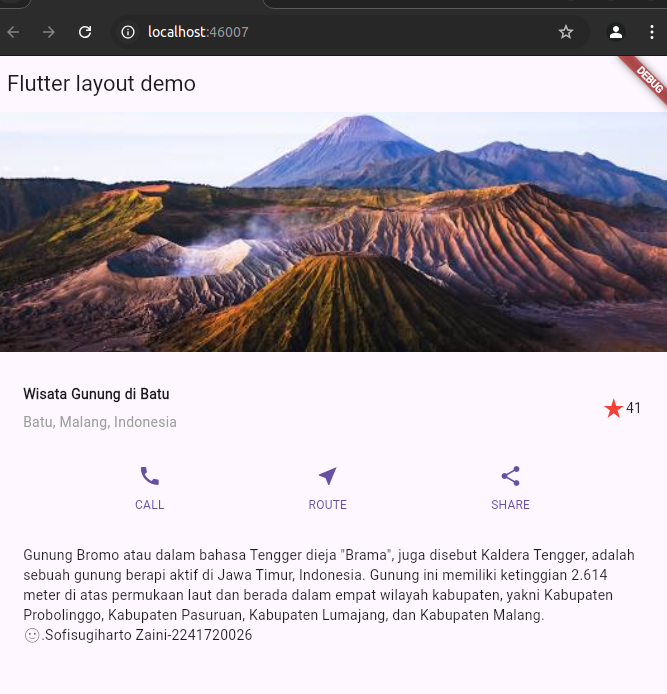

# Nama:SofiSugiharto Zaini

# Kelas:TI3C

# Absen:25

# Praktikum1

## Langkah2

Buka file main.dart lalu ganti dengan kode berikut. Isi nama dan NIM Anda di text title.

## Langkah4

Implementasi title row
Pertama, Anda akan membuat kolom bagian kiri pada judul. Tambahkan kode berikut di bagian atas metode build() di dalam kelas MyApp:

# Praktikum2

# Praktikum3

# Praktikum4

