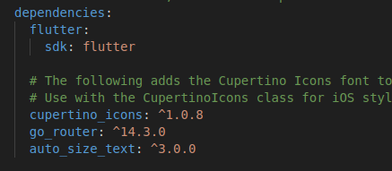
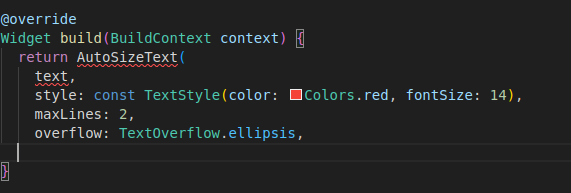
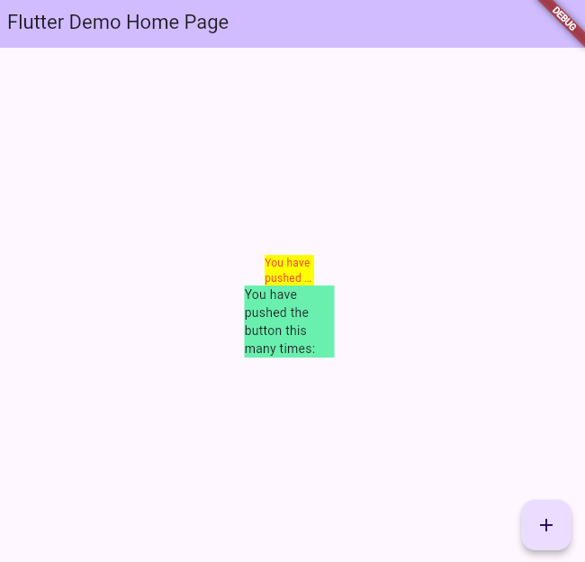

# Praktikum 7

### Langkah 1

Buatlah sebuah project flutter baru dengan nama flutter_plugin_pubdev. Lalu jadikan repository di GitHub Anda dengan nama flutter_plugin_pubdev.

### Langkah 2

Tambahkan plugin auto_size_text menggunakan perintah berikut di terminal
flutter pub add auto_size_text
Jika berhasil, maka akan tampil nama plugin beserta versinya di file pubspec.yaml pada bagian dependencies. 

### Langkah 3

Langkah 3: Buat file red_text_widget.dart
Buat file baru bernama red_text_widget.dart di dalam folder lib lalu isi kode seperti berikut.

import 'package:flutter/material.dart';

class RedTextWidget extends StatelessWidget {
const RedTextWidget({Key? key}) : super(key: key);

@override
Widget build(BuildContext context) {
return Container();
}
}

### Langkah 4

Masih di file red_text_widget.dart, untuk menggunakan plugin auto_size_text, ubahlah kode return Container() menjadi seperti berikut. 
 
Setelah Anda menambahkan kode di atas, Anda akan mendapatkan info error. Mengapa demikian? Jelaskan dalam laporan praktikum Anda! <b>Karena package auto size text belum di import di dalam file tersebut dan variable text belum terdefinisi</b>

### Langkah 5

Tambahkan variabel text dan parameter di constructor seperti berikut.

final String text;

const RedTextWidget({Key? key, required this.text}) : super(key: key);

### Langkah 6

Langkah 6: Tambahkan widget di main.dart
Buka file main.dart lalu tambahkan di dalam children: pada class \_MyHomePageStat

# Tugas Praktikum

1. Selesaikan Praktikum tersebut, lalu dokumentasikan dan push ke repository Anda berupa screenshot hasil pekerjaan beserta penjelasannya di file README.md!
2. Jelaskan maksud dari langkah 2 pada praktikum tersebut! 
   Langkah no 2 digunakan untuk menginstal library auto size text,dan hasil libary yang diinstal tersimpan di pubspec.yaml
3. Jelaskan maksud dari langkah 5 pada praktikum tersebut! 
   Langkah no 5 digunakan untuk variable menampung text yang digunakan di parameter saat pemanggilan Red Text Widget
4. Pada langkah 6 terdapat dua widget yang ditambahkan, jelaskan fungsi dan perbedaannya! 
   Perbedaan nya terletak pada widget yang digunakan widget pertama menggunakan widget red_text_widget yang berisi libray auto_size text sehinggan text yang muncul secara otomatis disesuaikan dengan widthnya ,Berbeda dengan yang kedua menggunakan widget text biasa yang dapat memunculkan text secara biasa
5. Jelaskan maksud dari tiap parameter yang ada di dalam plugin auto_size_text berdasarkan tautan pada dokumentasi ini ! 
   key: Mengontrol bagaimana satu widget menggantikan widget lain di dalam aplikasi. 
   textKey: Memberikan identitas unik untuk teks yang ditampilkan. 
   style: Menentukan gaya teks, seperti warna dan ukuran huruf, jika diisi. 
   minFontSize: Ukuran huruf terkecil yang digunakan saat ukuran huruf otomatis disesuaikan. 
   maxFontSize: Ukuran huruf terbesar yang digunakan saat ukuran huruf otomatis disesuaikan. 
   stepGranularity: Mengatur seberapa besar perubahan ukuran huruf saat disesuaikan. 
   presetFontSizes: Daftar ukuran huruf yang sudah ditentukan sebelumnya. Ukurannya harus diurutkan dari yang terbesar ke yang terkecil. 
   group: Sinkronisasi ukuran teks pada beberapa widget teks sekaligus. 
   textAlign: Mengatur bagaimana teks ditempatkan secara horizontal, misalnya rata kiri, kanan, atau tengah. 
   textDirection: Menentukan arah teks, apakah dari kiri ke kanan (seperti bahasa Indonesia) atau dari kanan ke kiri. 
   locale: Memilih font yang sesuai berdasarkan bahasa atau wilayah tertentu. 
   softWrap: Menentukan apakah teks boleh berpindah baris saat terlalu panjang. 
   wrapWords: Mengatur apakah kata-kata yang panjang akan dipisah dan dilanjutkan ke baris berikutnya. 
   overflow: Menentukan bagaimana menangani teks yang terlalu panjang untuk ditampilkan sepenuhnya. 
   overflowReplacement: Jika teks terlalu panjang dan tidak muat, widget pengganti akan ditampilkan. 
   textScaleFactor: Mengatur seberapa besar teks akan tampil, memengaruhi ukuran huruf secara keseluruhan. 
   maxLines: Batas maksimum jumlah baris teks yang bisa ditampilkan. 
   semanticsLabel: Label alternatif untuk teks, biasanya untuk keperluan aksesibilitas agar mudah dipahami. 
